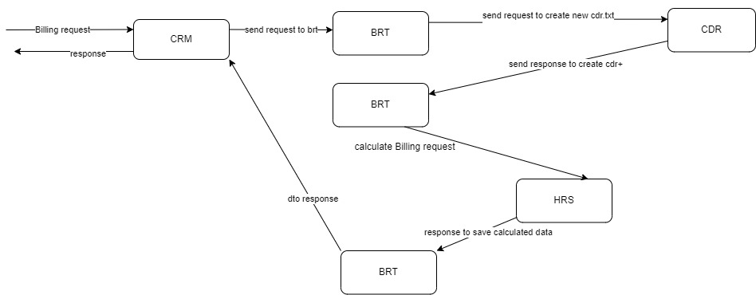
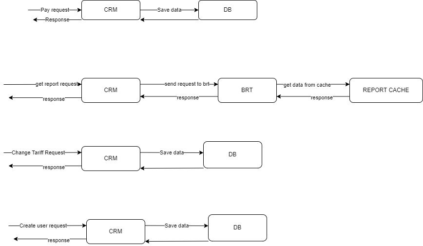

## Генератор CDR

Находится в пакете с CDR: src/test/java/*/utils/CdrGenerator

## План тестирования

  
*схема запросов между сервисами by Sa1ZeR*

### Юнит-тесты

Юнит-тесты эндпоинтов контроллеров микросервисов (brt, cdr, crm, hrs etc) для проверки корректности работы
каждого сервиса в отдельности. Для проверки использовать Mockito (для запросов на другие сервисы написать заглушки)
.  

#### brt -----------------------------------------------------------------------------------------------------------

#### UT-1: Получение детализации звонков по номеру телефона  

Шаги: 

1. Выполнить GET:  `` /api/v1/brt/report/getReportByPhone/{numberPhone} `` с параметрами запроса:  

| numberPhone  | Ожидаемый результат |
|--------------|---------------------|
| +78005553535 | 200 ОК              |
| 7800553535   | 200 ОК              |
| 88005553535  | 200 ОК              |
| 880055535355 | 400 Bad Request     |
| 88005553535f | 400 Bad Request     |

#### UT-2: Получение информации о тарифе абонентов  

Шаги: 

1. Сделать запрос PATCH: `` /api/v1/brt/report/billing `` с телом:  

| json                                  | Ожидаемый результат |
|---------------------------------------|---------------------|
| {"action": "RUN", "clear0ld": false}  | 200 ОК              |
| {"action": "STOP", "clear0ld": false} | 400 Bad Request     |

#### cdr -----------------------------------------------------------------------------------------------------------

#### UT-3: Создание CDR файл  

Предусловие: 
Шаги: 

1. Сделать запрос PATCH: `` /api/v1/cdr/update ``  
   Ожидаемый результат:  
2. 200 ОК  

#### crm -----------------------------------------------------------------------------------------------------------

#### UT-4: Пополнение счет клиента   

Шаги: 

1. Сделать запрос PATCH: `` /api/v1/abonent/pay `` с телом запроса json:  

| numberPhone  | money | Ожидаемый результат |
|--------------|-------|---------------------|
| 78005553535  | 0     | 400 Bad Request     |
| 78005553535  | 1     | 200 ОК              |
| 78005553535  | 2     | 200 ОК              |
| 78005553535  | 10000 | 200 ОК              |
| +78005553535 | 100   | 200 ОК              |
| 88005553535  | 1     | 200 ОК              |
| 880055535355 | 0     | 400 Bad Request     |
| 88005553535f | 100   | 400 Bad Request     |

#### UT-5: Получение детализации для клиента   

Шаги: 
1. Сделать запрос GET: `` /api/v1/abonent/report/{numberPhone} `` с параметрами запроса:  

| numberPhone  | Ожидаемый результат |
|--------------|---------------------|
| +78005553535 | 200 ОК              |
| 78005553535  | 200 ОК              |
| 88005553535  | 200 ОК              |
| 880055535355 | 400 Bad Request     |
| 88005553535f | 400 Bad Request     |

#### UT-6: Вход в систему для менеджера   

Шаги: 
1. Сделать запрос POST: `` /api/v1/auth/signin `` с телом запроса json: 

| numberPhone  | password | Ожидаемый результат |
|--------------|----------|---------------------|
| 79024333333  | null     | 400 Bad Request     |
| 79024333333  | admin    | 200 ОК              |
| +78005553535 | admin    | 200 ОК              |
| 88005553535  | admin    | 200 ОК              |
| 880055535355 | admin    | 400 Bad Request     |
| 88005553535f | admin    | 400 Bad Request     |

#### UT-7: Проверка вохможности смены тарифа   

Шаги: 
1. Сделать запрос PATCH: `` /api/v1/manager/changeTariff `` с телом запроса json: 

| numberPhone  | tariff_id | Ожидаемый результат |
|--------------|-----------|---------------------|
| 79024333333  | null      | 400 Bad Request     |
| 79024333333  | a         | 400 Bad Request     |
| 79024333333  | -1        | 400 Bad Request     |
| 79024333333  | 6         | 200 ОК              |
| 88005553535  | 6         | 200 ОК              |
| 880055535355 | 6         | 400 Bad Request     |
| 88005553535f | 6         | 400 Bad Request     |

#### UT-8: Создание нового пользователя(абонента)   

Шаги: 
1. Сделать запрос POST: `` /api/v1/manager/abonent `` с телом запроса json:  

| numberPhone  | tariff_id | balance | Ожидаемый результат |
|--------------|-----------|---------|---------------------|
| 79024333333  | null      | 0       | 400 Bad Request     |
| 79024333333  | a         | -1      | 400 Bad Request     |
| 79024333333  | -1        | 1       | 400 Bad Request     |
| 79024333333  | 6         | -1      | 400 Bad Request     |
| 79024333333  | 0         | 1       | 200 ОК              |
| 79024333333  | 06        | 1       | 200 ОК              |
| 88005553535  | 06        | 10      | 200 ОК              |
| 880055535355 | 06        | 10      | 400 Bad Request     |
| 88005553535f | 06        | 10      | 400 Bad Request     |

#### hrs -----------------------------------------------------------------------------------------------------------

#### UT-9: Проверка выполнения тарификации  

Шаги: 

1. Сделать запрос PATCH: `` /api/v1/hrs/billing `` с телом:  

| json                                  | Ожидаемый результат |
|---------------------------------------|---------------------|
| {"action": "RUN", "clear0ld": false}  | 200 ОК              |
| {"action": "STOP", "clear0ld": false} | 400 Bad Request     |

### Интеграционные тесты

Развернуть в локальной среде все сервисы и БД. Проверить соединение с БД, с другими сервисами.

#### IT-1: Проверка соединения с базой данных  
#### IT-2: Проверка правильности сохранения данных в БД  

#### IT-3: Проверка соединения между CRM и BRT  
Шаги:  
GET from CRM to BRT: `` /api/v1/brt/healthCheck ``  
Ожидаемый результат:  
200 ОК 

#### IT-4: Проверка соединения между BRT и CDR  
Шаги:  
GET from BRT to CDR: `` /api/v1/cdr/healthCheck ``  
Ожидаемый результат:  
200 ОК 

#### IT-5: Проверка соединения между BRT и HRS  
Шаги:  
GET from BRT to HRS: `` /api/v1/hrs/healthCheck ``  
Ожидаемый результат:  
200 ОК 

### Тестирование системной интеграции

Развернуть в локальной среде все сервисы и БД. С помощью rest-assured протестировать работу без моков(по use-case).

*схема запросов между сервисами by Sa1ZeR*

Необходимо проверить тело ответа для запросов, указанных в ТЗ:

#### SIT-1: Проверка возможности смены тарифа  

PATCH to CRM: ``/api/v1/manager/changeTariff``  

#### SIT-2: Проверка создания нового абонента  

POST to CRM: ``/api/v1/manager/abonent``  

#### SIT-3: Проверка возможности тарификации  
PATCH to CRM: ``/api/v1/manager/billing``  

... TBD

### Нагрузочное тестирование, подключение allure-reports, github CI or smth else

to be continued

